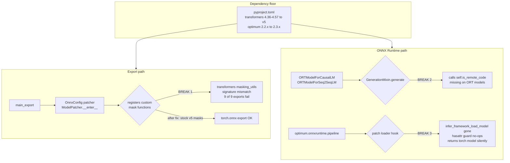

# Transformers v5-Only Support - Plan

## Goal Capsule

- **Objective:** Make optimum-onnx export and run models under transformers v5, and drop the v4 range from the supported set.
- **Authority hierarchy:** This plan > repo conventions > upstream optimum-onnx `main`. Where this plan and upstream disagree, this plan wins — this is a fork that deliberately diverges on the supported transformers range.
- **Execution profile:** Fix the three root-cause breakages first, then realign tests and CI. Each unit is a reviewable commit.
- **Stop conditions:** Stop and surface if a fix requires changing `optimum` core (out of scope — core already supports v5), or if a root-cause fix turns out to need a behavior change that alters exported ONNX graph semantics rather than just restoring them.
- **Tail ownership:** This plan covers the first PR only. Deleting the now-dead v4 version gates is a deliberate follow-up PR (see Scope Boundaries).

---

## Product Contract

### Summary

Move optimum-onnx to a transformers v5-only baseline: raise the dependency floor, remove an export-path workaround that v5 made obsolete, restore ONNX Runtime generation and pipeline compatibility against v5's changed model and pipeline APIs, drop the one exporter config whose architecture v5 deleted, and collapse the CI matrix to v5.

### Problem Frame

optimum-onnx currently pins `transformers>=4.36,<4.58.0`. transformers 5.14.1 is the current release, so the package is uninstallable alongside it and users are stuck on the v4 line.

The pin is not the only problem. With the ceiling bypassed and transformers 5.14.1 installed, **every ONNX export fails** — nine of nine representative cases across encoder-only, decoder, seq2seq, vision, and speech families die with the same `TypeError`. The ONNX Runtime layer fails separately: `generate()` raises on every ORT model that inherits `GenerationMixin`, and the pipeline integration degrades silently rather than erroring.

`optimum` core is not a blocker, contrary to the initial assumption. optimum 2.2.0 (June 2026) shipped as "Transformers v5 Support & Deprecation Cleanup" and declares `transformers>=4.29` with no upper bound; 2.3.0 (2026-08-04) keeps that. All 23 symbols optimum-onnx imports from optimum core resolve cleanly under transformers 5.14.1 + optimum 2.3.0. The only thing holding optimum-onnx back from core is its own `optimum~=2.2.0` pin, which excludes 2.3.x. No fork of `optimum` is needed.

### Requirements

**Packaging and dependencies**

- R1. optimum-onnx declares transformers v5 as its supported range and no longer claims v4 support.
- R2. The `optimum` core pin admits 2.3.x.
- R11. The declared Python floor is at least 3.10, matching transformers v5.

**Export path**

- R3. The exporter no longer registers a custom SDPA/eager mask implementation into transformers' mask-function registry.
- R4. ONNX export succeeds under transformers 5.14.x for the task families the fast exporter suite covers.
- R5. Exporter configs for architectures absent from transformers v5 are removed, along with their test fixtures.

**ONNX Runtime path**

- R6. ORT model classes that inherit `GenerationMixin` support `generate()` under v5.
- R7. `optimum.onnxruntime.pipeline()` loads ORT models, or fails loudly — it never silently returns a non-ORT model.
- R8. Pipeline task registrations that v5 removed no longer advertise support, in code or in the `pipeline()` docstring.

**Tests and CI**

- R9. The fast exporter and ONNX Runtime suites pass under transformers v5.
- R10. CI exercises transformers v5 only.

### Scope Boundaries

#### Deferred to follow-up work

- **Deleting the dead v4 version gates.** Under a v5-only floor, every `is_transformers_version(">=", "4.x")` gate in `optimum/` is unconditionally true and every `is_transformers_version("<", "4.x")` gate is unconditionally false (except three `< "4.99"` v5 sentinels, which are false under v5). Roughly 57 call sites plus their dead branches — including the `TraceableCache` import branch and the `CLIPAttention`/`CLIPSdpaAttention` branch in `optimum/exporters/onnx/model_patcher.py` — collapse. This is a separate PR so the first one stays a reviewable "does it work under v5" change rather than a large mechanical deletion that buries it.
- **`examples/`.** The Trainer-based scripts use `TrainingArguments` fields and `use_auth_token` that v5 removed outright. Out of the active plan.
- **`docs/`.** The `.mdx` guides carry `use_auth_token` doctests and reference removed pipeline tasks. Out of the active plan.
- **Renaming `ORTModelForVision2Seq`.** Under v5 its `auto_model_class` resolves to `AutoModelForImageTextToText` through an existing `try`/`except` alias, so the class works; only the name is stale. Renaming is a public API break worth its own decision.

#### Outside this plan's identity

- **Forking or patching `optimum` core.** Verified unnecessary — see Problem Frame.
- **Preserving transformers v4 compatibility.** The decision is v5-only; dual support is explicitly not a goal.
- **Restoring pipeline tasks v5 deleted.** Reimplementing `question-answering`, `summarization`, or `translation` pipelines locally is a product decision, not a migration step.

---

## Planning Contract

### Key Technical Decisions

- KTD1. **Delete the custom mask patching rather than port it.** optimum-onnx registers `sdpa_mask_without_vmap` / `eager_mask_without_vmap` into `ALL_MASK_ATTENTION_FUNCTIONS` (`optimum/exporters/onnx/model_patcher.py:693-694`) to avoid `vmap`, which does not trace to ONNX. transformers v5 upstreamed exactly that: `masking_utils.sdpa_mask` now takes `use_vmap: bool = False` as a built-in parameter, defaulting to the non-vmap path. The workaround is obsolete, not broken. Substituting stock v5 `sdpa_mask`/`eager_mask` takes the export probe from 0/9 to 6/6 passing.

- KTD2. **Supply `is_remote_code()` on the ORT generation base rather than inheriting `PreTrainedModel`.** v5's `GenerationMixin.prepare_inputs_for_generation` calls `self.is_remote_code()` (`transformers/generation/utils.py:597`), a classmethod defined on `PreTrainedModel` (`transformers/modeling_utils.py:5029`). ORT models mix in `GenerationMixin` without inheriting `PreTrainedModel`, so the attribute is missing. Inheriting `PreTrainedModel` would drag in torch-module weight semantics that ORT models deliberately avoid; providing the classmethod is the minimal correct fix. ORT models are never remote code, so it returns `False`.

- KTD3. **Make the pipeline loader hook fail loudly instead of degrading.** `patch_pipelines_to_load_ort_model()` (`optimum/onnxruntime/pipelines.py:137-151`) swaps `transformers.pipelines.infer_framework_load_model`, guarded by `hasattr`. That symbol does not exist in v5, so the guard turns the whole patch into a silent no-op and `pipeline()` falls through to stock transformers model loading — returning a torch model while the caller believes they have an ORT one. Silent wrong-backend is worse than an error. Rebind against v5's actual loader entry point, and raise if no supported hook is found.

- KTD4. **Drop the six pipeline tasks v5 removed rather than reimplement them.** `ORT_TASKS_MAPPING` (`optimum/onnxruntime/pipelines.py:63-81`) registers `image-to-image`, `image-to-text`, `question-answering`, `summarization`, `text2text-generation`, and `translation`; none exist in `transformers.pipelines.SUPPORTED_TASKS` under v5. Keeping them means advertising tasks that raise `KeyError` inside transformers. The corresponding **export** tasks are unaffected and stay — they live in optimum's own `TasksManager` namespace, which is independent of the pipeline registry. The ORT model classes themselves also stay; only the pipeline registrations go.

- KTD5. **Set the floor at `transformers>=5.14` rather than `>=5.0`.** A high floor keeps the fixes here targeted at one known API shape instead of reintroducing intra-v5 gating for the mask and generation APIs, which moved during the 5.x line. Confirmed against `is_transformers_version` gate density that a low floor would immediately recreate.

### High-Level Technical Design

Three independent breakages sit on two paths. The export path has one blocker; the runtime path has two. Nothing shares a fix, and nothing is ordered relative to the others except that the dependency floor must land first.

Prose is authoritative where it and the diagram disagree.

### Assumptions

- The export-probe result generalizes: fixing the mask registration unblocks the export families beyond the six retested. Whisper and the diffusion path were not re-verified post-fix; U6 is where that assumption gets tested rather than assumed.
- `diffusers` is not a blocker. diffusers 0.39.0 declares no transformers upper bound outside its test/dev extras. The diffusion suite may still surface issues, but not a pin conflict.
- `huggingface_hub>=1.0` arrives transitively through transformers v5; optimum-onnx does not need to declare it.

---

## Implementation Units

### U1. Move the dependency floor to transformers v5

- **Goal:** optimum-onnx installs alongside transformers 5.14+ and optimum 2.3.x.
- **Requirements:** R1, R2, R11
- **Dependencies:** none
- **Files:** `pyproject.toml`
- **Approach:** Replace `transformers>=4.36,<4.58.0` with a v5 floor per KTD5. Replace `optimum~=2.2.0` with a constraint admitting 2.3.x. Leave the `onnx` / `onnxscript` / `onnxruntime` constraints alone. Raise `requires-python` from `>=3.9.0` to `>=3.10` and drop the `Programming Language :: Python :: 3.9` classifier: transformers 5.14.1 declares `requires_python: >=3.10.0`, so the current floor is not merely stale but contradictory — pip would resolve a Python 3.9 install to a transformers version the package no longer supports. Consider adding the 3.14 classifier, which transformers v5 already ships.
- **Execution note:** This unit alone leaves the tree red. That is expected; U2-U5 make it green.
- **Test scenarios:**
  - A clean install of the package resolves with transformers 5.14.x and optimum 2.3.x present, with no pip resolution conflict.
  - `python -c "import optimum.onnx, optimum.exporters.onnx, optimum.onnxruntime"` succeeds under that resolution.
- **Verification:** The declared range admits the current transformers and optimum releases, and the package imports.

### U2. Remove the obsolete SDPA/eager mask patching

- **Goal:** ONNX export stops failing on the mask-function signature mismatch.
- **Requirements:** R3, R4
- **Dependencies:** U1
- **Files:** `optimum/exporters/onnx/model_patcher.py`
- **Approach:** Per KTD1, remove `sdpa_mask_without_vmap` and `eager_mask_without_vmap`, their registration in `ModelPatcher.__enter__` (~line 692), and the restore in `__exit__` (~line 717). Remove the now-unused `_prepare_padding_mask_slice` probe and whichever `masking_utils` imports become unreferenced — but keep `find_packed_sequence_indices`, which a separate still-live patch uses. Confirm whether the `find_packed_sequence_indices` and `DynamicLayer.update` patches are still needed under v5 rather than removing them speculatively; both target `torch.diff` / `torch.cat` tracing problems that are independent of the mask change.
- **Patterns to follow:** The existing `__enter__`/`__exit__` save-and-restore structure in the same class — anything kept should keep that shape.
- **Test scenarios:**
  - Exporting `hf-internal-testing/tiny-random-BertModel` for `feature-extraction` produces an ONNX file without raising.
  - Exporting `hf-internal-testing/tiny-random-GPT2LMHeadModel` for `text-generation-with-past` succeeds, and the exported graph carries past-key-value inputs and outputs.
  - Exporting `hf-internal-testing/tiny-random-T5ForConditionalGeneration` for `text2text-generation-with-past` succeeds for encoder and decoder parts.
  - Exporting `hf-internal-testing/tiny-random-ViTForImageClassification` for `image-classification` succeeds — the vision path routes through `create_bidirectional_mask` and failed identically before the fix.
  - Exporting `openai/whisper-tiny` for `automatic-speech-recognition-with-past` succeeds. This case was not covered by the post-fix probe and is the one most likely to surface a second mask-related issue.
  - Export validation (output-tensor comparison against the torch model) passes within the config's `ATOL_FOR_VALIDATION` for at least one decoder and one seq2seq case — proving the graph is correct, not merely that export completed.
- **Verification:** `pytest tests/exporters/onnx/test_export.py` passes, and no export raises `TypeError` from a mask function.

### U3. Restore ORT generation compatibility

- **Goal:** `generate()` works on ORT models under v5.
- **Requirements:** R6
- **Dependencies:** U1
- **Files:** `optimum/onnxruntime/modeling.py`, `optimum/onnxruntime/modeling_decoder.py`, `optimum/onnxruntime/modeling_seq2seq.py`, `tests/onnxruntime/test_decoder.py`, `tests/onnxruntime/test_seq2seq.py`
- **Approach:** Per KTD2, add an `is_remote_code()` classmethod returning `False` to the ORT base that generation-capable models share. Place it once at the highest class that all `GenerationMixin`-mixing ORT models inherit from, rather than repeating it per subclass — check whether `ORTModel` or the parent mixin in `optimum/onnxruntime/base.py` is the right host. While here, check for other `PreTrainedModel`-only attributes v5's generation path reaches for; `is_remote_code` was the first failure, not necessarily the only one, so drive this by running generation rather than by reading the migration guide.
- **Execution note:** Run a real `generate()` round-trip before writing the fix, so the failure list is empirical.
- **Test scenarios:**
  - `ORTModelForCausalLM.from_pretrained(..., export=True).generate(...)` with `max_new_tokens=5, do_sample=False` returns a sequence longer than the input.
  - `ORTModelForSeq2SeqLM` greedy `generate()` returns a non-empty sequence.
  - `ORTModelForSpeechSeq2Seq` (Whisper) `generate()` produces a transcription without raising.
  - Greedy generation output matches the equivalent torch model's output token-for-token for a tiny fixture, proving the fix restores behavior rather than merely suppressing the error.
  - `ORTModelForFeatureExtraction` forward still works — a non-generation regression check on the shared base class.
- **Verification:** `pytest tests/onnxruntime/test_decoder.py tests/onnxruntime/test_seq2seq.py` passes.

### U4. Repair the ONNX Runtime pipeline integration

- **Goal:** `optimum.onnxruntime.pipeline()` returns ORT models for the tasks it advertises, and advertises only tasks that exist.
- **Requirements:** R7, R8
- **Dependencies:** U1, U3
- **Files:** `optimum/onnxruntime/pipelines.py`, `optimum/onnxruntime/modeling.py`, `optimum/onnxruntime/modeling_seq2seq.py`, `tests/onnxruntime/test_modeling.py`
- **Approach:** Per KTD3, rebind `patch_pipelines_to_load_ort_model()` to v5's actual model-loading entry point — `transformers.pipelines.base` exposes `load_model`, not the removed `infer_framework_load_model`; confirm the signature before wiring. Replace the silent `else: yield` fallback with a raise, so an unrecognized transformers internal fails at call time instead of returning a torch model. Per KTD4, remove the six dead task keys from `ORT_TASKS_MAPPING` and the `translation_` prefix handling at line ~89, and strip those tasks plus `visual-question-answering` from the `pipeline()` docstring. Update the doctests that call removed tasks: `modeling.py:871` (`question-answering`), `modeling_seq2seq.py:270` (`translation_en_to_de`), `modeling_seq2seq.py:352` (`image-to-text`).
- **Patterns to follow:** The existing contextmanager save-and-restore shape in the same function.
- **Test scenarios:**
  - `pipeline("text-generation", model=<ORTModelForCausalLM>)` returns a pipeline whose `model` is an `ORTModel` instance — the assertion that would have caught the silent no-op.
  - `pipeline("feature-extraction", ...)` and `pipeline("text-classification", ...)` likewise return ORT-backed pipelines and produce output.
  - `pipeline("question-answering", ...)` raises a clear optimum-side error naming the task as unsupported, rather than a bare transformers `KeyError`.
  - Every key remaining in `ORT_TASKS_MAPPING` is present in `transformers.pipelines.SUPPORTED_TASKS` — a guard test that fails loudly if a future transformers release removes another task.
  - The `pipeline()` docstring lists no task absent from `ORT_TASKS_MAPPING`.
- **Verification:** `pytest tests/onnxruntime/test_modeling.py -k pipeline` passes, and the mapping-vs-transformers guard test passes.

### U5. Drop the `mctct` exporter config

- **Goal:** The exporter stops registering an architecture transformers v5 removed.
- **Requirements:** R5
- **Dependencies:** U1
- **Files:** `optimum/exporters/onnx/model_configs.py`, `tests/exporters/onnx/utils_tests.py`, `tests/onnxruntime/testing_utils.py`
- **Approach:** Remove `MCTCTOnnxConfig` (`model_configs.py:1906`) and its `@register_tasks_manager_onnx` registration, plus the `mctct` entries in the test model fixtures. `mctct` is the only registered transformers architecture absent from transformers 5.14.1 — `transformers.models.mctct` raises `ModuleNotFoundError` and it is not under `transformers.models.deprecated` either. Leave `internlm2` alone: it registers a `model_type` that was never in transformers (remote-code only), so it is not a v5 casualty. Leave the 16 synthetic diffusers/timm/sentence-transformers registrations alone — those names are sub-component identifiers, not transformers model types.
- **Test scenarios:**
  - Every `model_type` registered via `register_tasks_manager_onnx` with `library_name="transformers"` resolves in `transformers.models.auto.configuration_auto.CONFIG_MAPPING_NAMES`. This guard belongs in `tests/exporters/common/test_tasks_manager.py`; it would have caught `mctct` automatically and will catch the next upstream removal.
  - The guard tolerates the 16 synthetic registrations (diffusers, timm, sentence-transformers sub-component names such as `vae-encoder`, `default-timm-config`) by filtering on declared `library_name` — a naive version of this test fails on those and must not be written that way. Note that `siglip-text` and `siglip-text-with-projection` declare `transformers` as their library but are synthetic names, so they need an explicit exemption.
  - `mctct` no longer appears in the exporter's supported model types, and the test fixtures referencing it are gone.
- **Verification:** `pytest tests/exporters/common/test_tasks_manager.py` passes, including the new registration guard.

### U6. Realign the test suite to a v5-only baseline

- **Goal:** The test suite expresses v5 expectations instead of branching on v4 behavior.
- **Requirements:** R9
- **Dependencies:** U2, U3, U4, U5
- **Files:** `tests/onnxruntime/test_decoder.py`, `tests/onnxruntime/test_seq2seq.py`, `tests/onnxruntime/test_modeling.py`, `tests/onnxruntime/test_diffusion.py`, `tests/onnxruntime/test_optimization.py`, `tests/exporters/onnx/test_export.py`, `tests/exporters/onnx/test_export_cli.py`
- **Approach:** Work failure-first: run each suite under v5, fix what fails, and only then tidy. Resolve `is_transformers_version` branches in tests to their v5 arm where the branch now has one reachable side — for example `tests/onnxruntime/test_seq2seq.py:1202` picks `image-to-text` vs `image-text-to-text` on a `< "5.0"` check, which is now always the v5 arm. Do not attempt an exhaustive gate sweep here; that is the follow-up PR's job, and mixing it in makes this diff unreviewable. Fix only gates that produce wrong expectations under v5.
- **Execution note:** Expect this unit to surface issues U2-U4 did not, particularly in the diffusion and Whisper paths. Route genuine library bugs back into the relevant unit rather than papering over them with a skip.
- **Test scenarios:**
  - `tests/exporters/onnx/test_export.py` passes with no v4-conditional expectations remaining that affect outcomes.
  - `tests/onnxruntime/test_decoder.py` and `test_seq2seq.py` pass, including the with-past and merged-decoder variants.
  - `tests/onnxruntime/test_modeling.py` passes.
  - `tests/onnxruntime/test_diffusion.py` passes, or its failures are triaged and recorded as known non-gating with a reason — this suite depends on diffusers as well as transformers.
  - Any test skipped for v5 reasons carries an explicit reason string naming what is unsupported, so skips are auditable rather than silent.
- **Verification:** The fast exporter and ONNX Runtime suites pass under transformers 5.14.x, and every remaining skip has a stated reason.

### U7. Collapse the CI matrix to transformers v5

- **Goal:** CI proves the v5-only claim and stops testing versions the package no longer supports.
- **Requirements:** R10
- **Dependencies:** U6
- **Files:** `.github/workflows/test_onnxruntime.yml`
- **Approach:** Replace the `transformers_version: [latest, 4.36.*, 4.45.*, 4.56.*]` matrix axis with v5 entries, and delete the per-version install branches (lines ~58-78) that special-case 4.36/4.45/4.56, including the `diffusers<0.32.0` / `diffusers<0.33.0` pins those branches carry. Keep `latest` so upstream breakage surfaces early. Decide whether a pinned v5 floor entry alongside `latest` is worth the CI minutes given KTD5's high floor — a single `latest` may be sufficient.
- **Test scenarios:**
  - `Test expectation: none — CI configuration.` Proof is the workflow running green, which is the unit's verification rather than an assertion in the suite.
- **Verification:** The workflow runs on the branch and its jobs pass, with no matrix entry installing a transformers 4.x release.

---

## Verification Contract

| Gate | Command | Applies to |
|---|---|---|
| Lint and format | `make style_check` | All units |
| Exporter suite | `pytest tests/exporters/onnx/test_export.py` | U2, U5, U6 |
| Tasks manager | `pytest tests/exporters/common/test_tasks_manager.py` | U5 |
| Decoder runtime | `pytest tests/onnxruntime/test_decoder.py` | U3, U6 |
| Seq2seq runtime | `pytest tests/onnxruntime/test_seq2seq.py` | U3, U6 |
| Core ORT modeling and pipelines | `pytest tests/onnxruntime/test_modeling.py` | U4, U6 |
| CLI | `pytest tests/cli/test_cli.py tests/exporters/onnx/test_export_cli.py` | U6 |
| CI matrix | Workflow run on the branch | U7 |

**Gating scope:** the fast exporter and ONNX Runtime suites gate. Slow, GPU, and diffusion-heavy suites (`test_onnxruntime_slow.yml`, `test_onnxruntime_gpu.yml`, `tests/onnxruntime/test_diffusion.py`) are tracked and triaged but do not gate this PR.

**Reproduction environment:** the findings behind this plan came from a clean virtualenv with `transformers==5.14.1`, `optimum==2.3.0`, `torch==2.13.0`, `onnx==1.22.0`, `onnxruntime==1.28.0`. Reproduce against that combination before concluding a fix did not work.

---

## Definition of Done

**Global**

- transformers v5 installs alongside optimum-onnx with no resolution conflict, and v4 is no longer claimed as supported.
- The gating suites in the Verification Contract pass under transformers 5.14.x.
- CI runs a v5-only matrix and is green.
- No fix suppresses a failure it did not actually resolve — no bare `skip` without a stated reason, no exception swallowing, no assertion loosened to accommodate a wrong result.
- Exploratory scaffolding is removed: no leftover probe scripts, debug prints, commented-out patch code, or abandoned compatibility branches from approaches that did not pan out.
- The v4 dead-gate cleanup is **not** in this PR — if it crept in, split it out.

**Per unit**

| Unit | Done signal |
|---|---|
| U1 | Package resolves and imports with transformers 5.14.x + optimum 2.3.x |
| U2 | Export succeeds across encoder, decoder, seq2seq, vision, and speech cases; validation passes within tolerance |
| U3 | `generate()` works on causal, seq2seq, and speech ORT models, matching torch output for a tiny fixture |
| U4 | `pipeline()` returns ORT-backed pipelines; removed tasks raise a clear error; mapping guard test passes |
| U5 | `mctct` gone; registration guard test passes |
| U6 | Gating suites pass; every remaining skip states its reason |
| U7 | Workflow green with no 4.x matrix entry |

---

## Open Questions

Both are deferred — neither blocks implementation.

- **`torch_dtype` is deprecated in favor of `dtype`.** `optimum/exporters/onnx/__main__.py:339` passes `torch_dtype=` to model loading, and transformers 5.14.1 emits `torch_dtype is deprecated! Use dtype instead!` on every export. It still works, so this is a warning-level item, not a break. Rename it here, or fold it into the follow-up cleanup PR alongside the dead gates.
- **`visual-question-answering` has a dead output-schema entry.** `optimum/exporters/onnx/base.py:140` defines an output schema for a task no model config registers, and which v5 also removed as a pipeline task. Harmless. Removing it fits the follow-up cleanup better than this PR.

---

## Risks & Dependencies

- **Dropping six pipeline tasks is a user-visible capability loss.** `question-answering`, `summarization`, `translation`, `text2text-generation`, `image-to-text`, and `image-to-image` disappear from `optimum.onnxruntime.pipeline()`. This is inherited from upstream transformers, not chosen here, and the corresponding ORT model classes and export tasks survive — but anyone calling `pipeline("question-answering", accelerator="ort")` is broken by this change. Worth calling out in the PR description.
- **The silent pipeline no-op may predate this work.** `infer_framework_load_model` was removed upstream at some point in the 5.x line; on any transformers version lacking it, `optimum.onnxruntime.pipeline()` has been returning torch models while callers believed they were ORT-backed. Treat U4 as a correctness fix, not only a migration step, and check whether it warrants a note in the changelog.
- **A high transformers floor tracks a fast-moving upstream.** KTD5 pins to 5.14+, which keeps the fixes simple but means intra-5.x churn lands directly. `latest` in CI is the early-warning signal.
- **The diffusion path is the least-verified area.** It depends on diffusers as well as transformers, and was not probed. U6 may surface work that neither U2 nor U3 anticipated.
- **Upstream divergence cost.** This fork's v5-only stance conflicts with upstream optimum-onnx's dual-support direction (PR #140 keeps `>=4.36,<6.0`). Rebases onto upstream `main` will conflict in the version-gate regions, and the follow-up dead-gate deletion PR will widen that. Accepted deliberately.

---

## Sources & Research

**Empirical findings (clean venv, transformers 5.14.1 + optimum 2.3.0 + torch 2.13.0)**

- Export probe, current code: 9 of 9 cases fail with `TypeError: sdpa_mask_without_vmap() missing 1 required positional argument: 'cache_position'` — BERT (feature-extraction, fill-mask, text-classification), DistilBERT (question-answering), GPT2, Llama, T5, ViT, Whisper.
- Export probe, stock v5 masking substituted: 6 of 6 retested cases pass.
- Runtime probe: causal and seq2seq `generate()` fail with `AttributeError: 'ORTModelForCausalLM' object has no attribute 'is_remote_code'`; feature-extraction forward passes.
- Import probe: all 23 symbols optimum-onnx imports from `optimum` core resolve under transformers 5.14.1 + optimum 2.3.0.

**Key upstream anchors**

- `transformers/masking_utils.py` — `sdpa_mask` signature in v5 takes `q_length`/`q_offset` and `use_vmap: bool = False`; the old contract took `cache_position`.
- `transformers/generation/utils.py:597` — calls `self.is_remote_code()`; defined at `transformers/modeling_utils.py:5029` on `PreTrainedModel`.
- `transformers.pipelines.SUPPORTED_TASKS` in v5 has 24 keys; `transformers.pipelines.base` exposes `load_model`, and `infer_framework_load_model` is absent.
- `DynamicCache.from_legacy_cache` / `.to_legacy_cache` are absent in v5; the only call sites (`optimum/exporters/onnx/model_patcher.py:208-234`) are already `hasattr`-guarded with working v5 fallbacks.
- optimum 2.2.0 release notes: "Transformers v5 Support & Deprecation Cleanup"; both 2.2.0 and 2.3.0 declare `transformers>=4.29` with no upper bound.
- Migration guide: https://github.com/huggingface/transformers/blob/main/MIGRATION_GUIDE_V5.md

**Prior art reviewed, not adopted**

- optimum-onnx PR #121 ("add support for transformers 5.2") and PR #140 ("Add Transformers v5 compatibility"). Both pursue dual v4/v5 support, which this fork rejects. PR #140 keeps the range at `>=4.36,<6.0` and adds a compatibility layer; this plan deletes the obsolete workaround instead.
- optimum core PR #2455 — proposes relaxing a `<6.0` transformers ceiling that is not present in the current pin, and only touches `optimum/fx/parallelization/`, a path optimum-onnx never imports. Stale; no action needed.

**Repo anchors**

- `optimum/exporters/onnx/model_patcher.py:404-454` (custom mask implementations), `:692-694` and `:717-719` (register/restore).
- `optimum/onnxruntime/pipelines.py:63-81` (`ORT_TASKS_MAPPING`), `:137-151` (loader patch).
- `optimum/exporters/onnx/model_configs.py:1906` (`MCTCTOnnxConfig`).
- `.github/workflows/test_onnxruntime.yml:29` (matrix), `:58-78` (per-version install branches).
